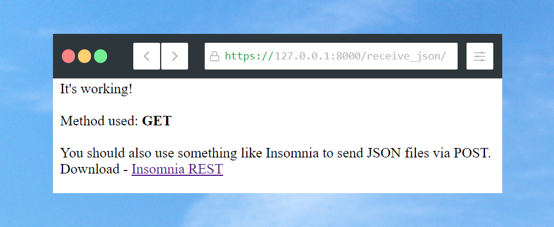

# Fictitious-opt
The simplest JSON receiver using Django3 ever.
 
 
 
 ## Installation
 Install Python3 and then Django.
 
 ## Usage
 Clone the repo, open the folder, run the Django server and voila.
 
Go to http://127.0.0.1:8000/receive_json/ and start testing request methods!

## Recommended
- [Insomnia](https://insomnia.rest/) to test API Methods.

## Resources
- Screenshots by [Screenshots Rocks](https://screenshot.rocks/)
- [Insomnia](https://insomnia.rest/), an Open Source API Client.
